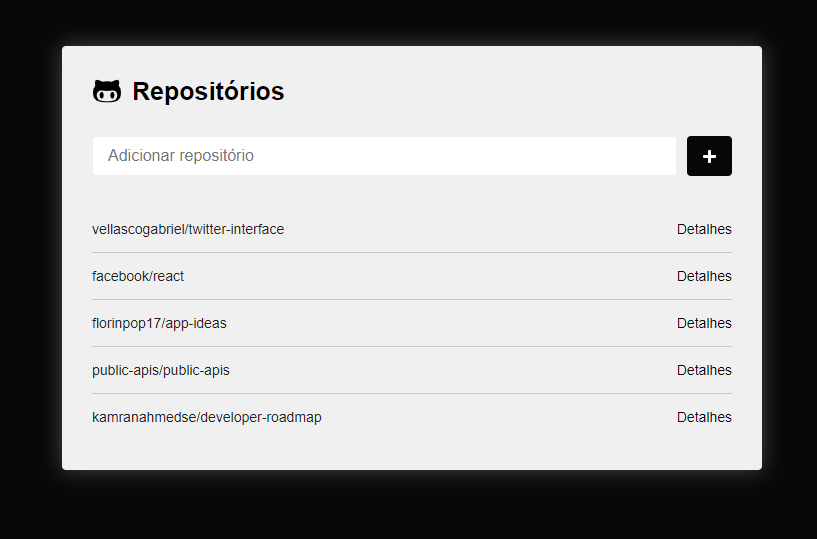

# Repositórios do Github

### Projeto feito com ReactJS que adiciona e lista alguns repositorios github.

- É possível acessar as issues dos repositórios através do link de "Detalhes".

- Ao acessar os detalhes é possível visualizar a foto de perfil do github e as 5 issues mais recentes do repositório.

